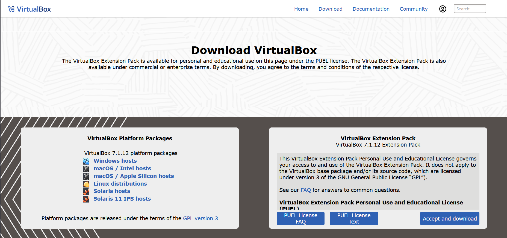
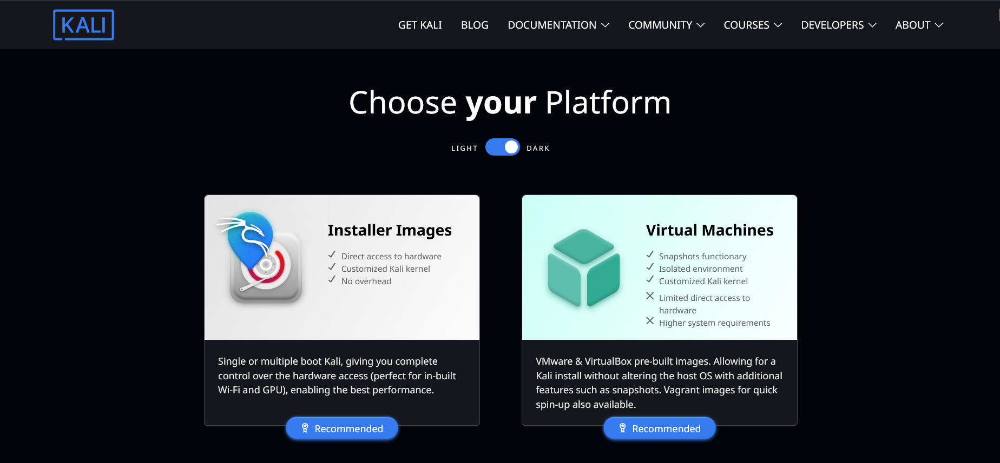
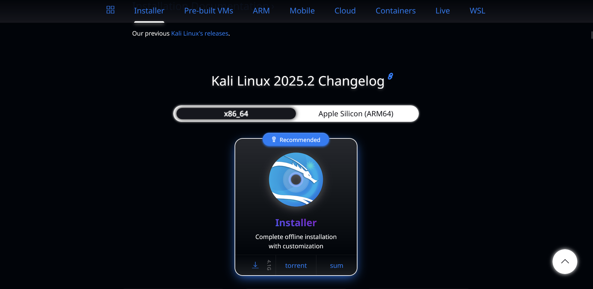
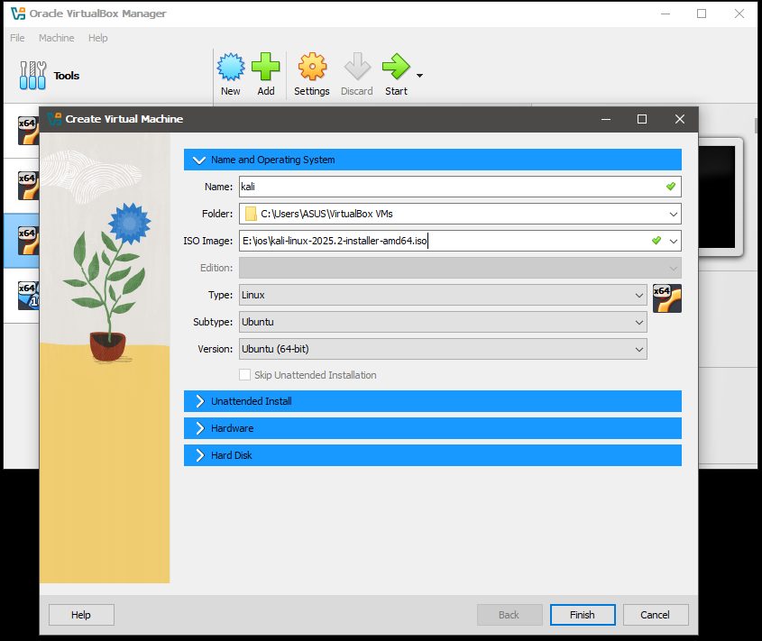
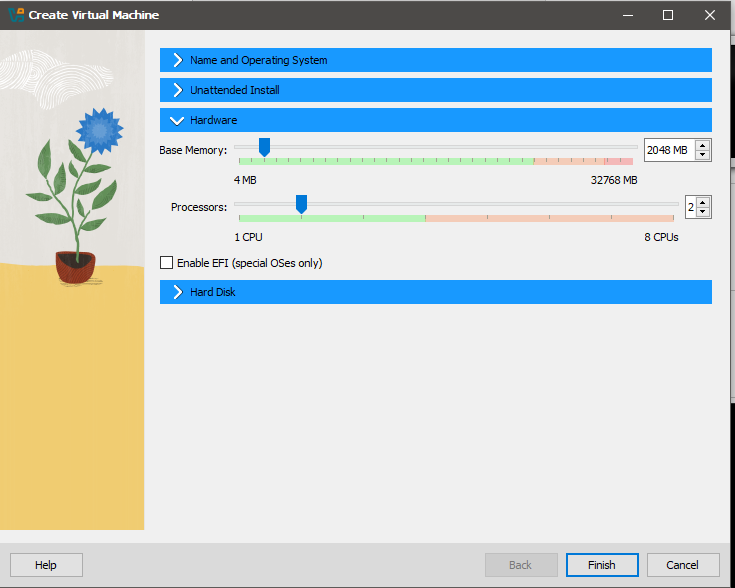
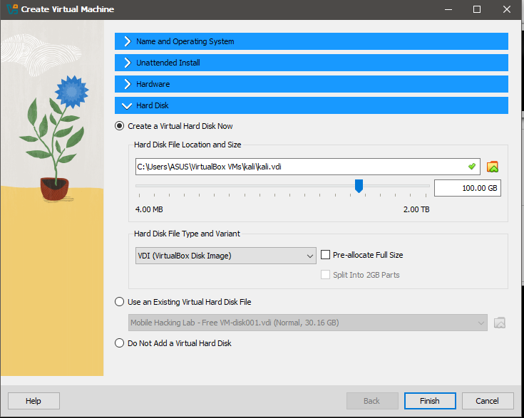
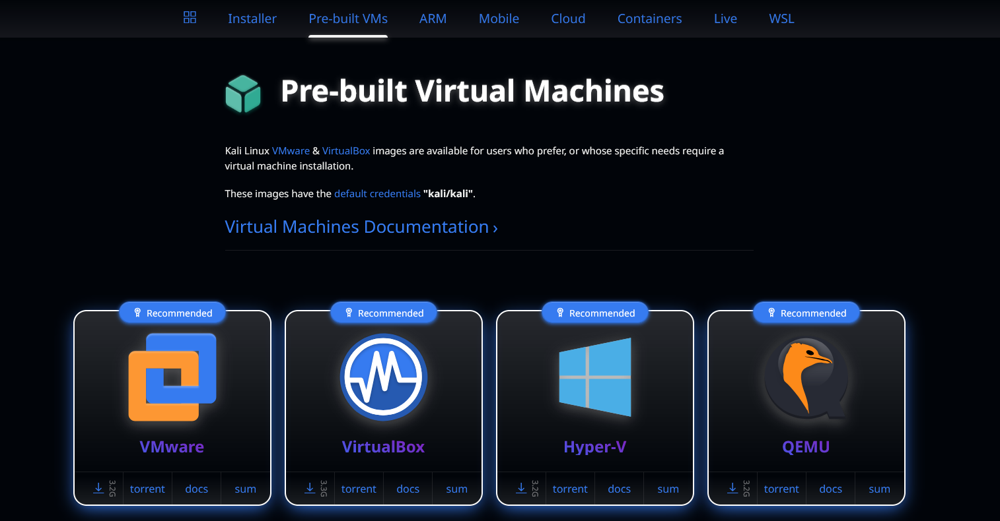
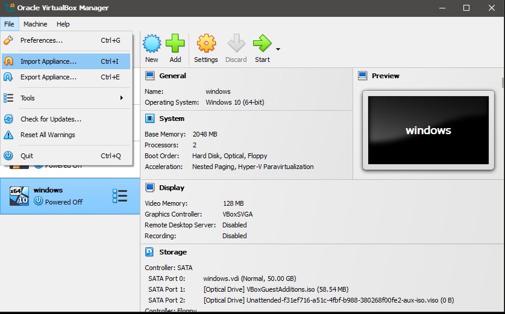
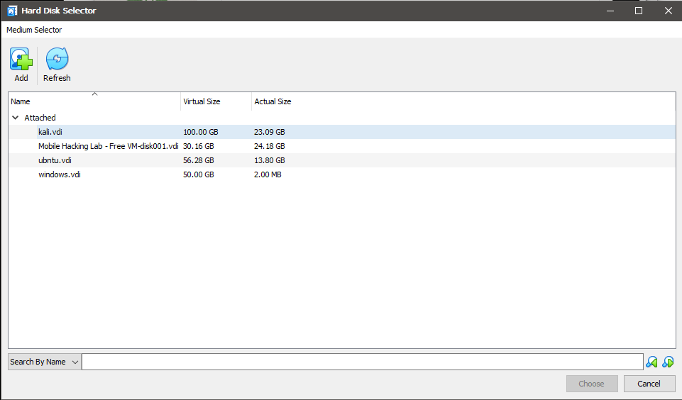
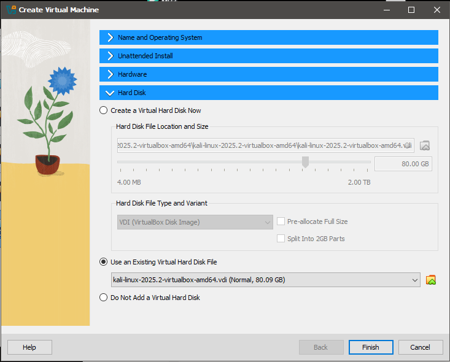

## 💻 Windows မှာ Kali Linux Install လုပ်နည်း (VirtualBox အသုံးပြုခြင်းဖြင့်)

> ဒီလမ်းညွှန်မှာတော့ Windows OS မှာ Kali Linux ကို Oracle VirtualBox အသုံးပြုပြီး Virtual Machine အနေနဲ့ Install လုပ်နည်းကို screenshot နှင့်အတူ ရှင်းလင်းပြထားပါတယ်။ Cybersecurity ကို စတင်လေ့လာမဲ့ Beginner များအတွက် ရည်ရွယ်ပါတယ်။

---

### 🛠️ လိုအပ်ချက်များ

| Tool | Description | Download Link |
|------|-------------|----------------|
| VirtualBox | VM Software | [Download VirtualBox](https://www.virtualbox.org/wiki/Downloads) |
| Kali Linux ISO | Kali installer | [Download Kali ISO](https://www.kali.org/get-kali/#kali-platforms) |
| Windows PC | RAM 4GB+, Disk Space 20GB+ | - |

---

### 1️⃣ VirtualBox install လုပ်ခြင်း

1. [VirtualBox Downloads](https://www.virtualbox.org/wiki/Downloads) မှာ windows အတွက် software ကို download ပြုလုပ်ပါ။
2. Installer ကို Run ပြီး Setup လုပ်ပါ။



---

### 2️⃣ Kali Linux ISO ဖိုင် Download လုပ်ပါ

  - ဒီနေရာမှာ နည်းလမ်း ၂မျိုးရှိပါတယ်။ 
    1. ISO file ဖြင့် install လုပ်ခြင်း။
    2. .vdi file ဖြင့် install လုပ်ခြင်း။

  


  ### ISO file ဖြင့် install လုပ်ခြင်း
  1. [Kali Linux Download Page](https://www.kali.org/get-kali/#kali-platforms) ကိုသွားပါ။
  2. Installer Images → 64-bit version ကို Download လုပ်ပါ။

  

---

### 3️⃣ Virtual Machine အသစ် Create လုပ်ပါ

1. VirtualBox ကိုဖွင့်ပြီး **New** ကိုနှိပ်ပါ။
2. Name: `Kali Linux`  
   Type: `Linux`  
   Version: `Debian (64-bit)`



---

### 4️⃣ RAM ထည့်ပါ

- အနည်းဆုံး: 2048 MB  
- အကြံပြု: 4096 MB



---

### 5️⃣ Virtual Hard Disk ဖန်တီးပါ

- Create → VDI → Dynamically allocated → 80 GB+



---

### 6️⃣ VM ကို Start လုပ်ပါ

1. Start ကိုနှိပ်ပြီး VM boot တက်လာသည်ကိုစောင့်ပါ။
2. Menu ထဲက “Graphical Install” ကိုရွေးပါ။


---

### 7️⃣ Kali Installation Setup

- Language, Location, Keyboard Layout တို့ကိုရွေးပါ။


- User, Hostname, Password ထည့်ပါ။


---

### 8️⃣ Partitioning Disk

- Guided – Use Entire Disk → All files in one partition


---

### 9️⃣ Installation Process

- System Installing...
- GRUB bootloader ကို Yes ပြီး `/dev/sda` သို့ Install ပြုလုပ်ပါ။


---

### ✅ Finish Installation

- Installation ပြီးသွားပါက Reboot ဖြစ်ပြီး Kali ကို စတင်အသုံးပြုနိုင်ပါပြီ။


---

  ### .VDI file ဖြင့် install လုပ်ခြင်း
  1. [Kali Linux Download Page](https://www.kali.org/get-kali/#kali-platforms) ကိုသွားပါ။
 
     
  
  2. Virtual Machine → virtualbox → ကို Download လုပ်ပါ။

     
  
  4. VirtualBox ကိုဖွင့်ပါ။ File > Import Appliance > source > ova file ကိုရွေးပေးလိုက်ပါ။

      
  5. Name ကို kali လို့ပေးပြီး Hard Disk ကိုသွားလိုက်ပါ။ Use an Existing Virtual Hard Disk File ဆိုတာ      ကို ရွေးပြီး folder ပုံလေးကို နှိပ်လိုက်ပါ။ Add ကို ထပ်နှိပ်ပြီး Kali .vdi file ရှိတဲ့နေရာကို ရွေးပေးလိုက်ပါ။
     
       
  
  7. Finish ကို နှိပ်ပါ။
  
       

  8. Kali ကို ရွေးပြီး start လုပ်ကာ စတင်အသုံးပြုလို့ရပါပီ။
 
  9. Username : kali
     Password : kali 
      
---
### 🧠 အသုံးဝင်သော အကြံပြုချက်များ

- Kali Full Screen လုပ်ချင်လျှင်:  
  **Devices → Insert Guest Additions CD image**
- Drag and Drop / Clipboard Sharing → Enable from **Settings > General > Advanced**
- Kali Update Command:
  ```bash
  sudo apt update && sudo apt upgrade -y
  ````

---

### 📎 YouTube Video (Coming Soon)

📽️ [Kali linux install on VirtualBox](#)

---

### 📚 ကိုးကား

* [Kali Linux Docs](https://www.kali.org/docs/)
* [VirtualBox Manual](https://www.virtualbox.org/manual/)

---

### 🙋 မေးမြန်းလိုတာများရှိပါက

* GitHub Issues မှာပြောနိုင်ပါတယ်။
* [PiiN Security](https://github.com/piinsec)
