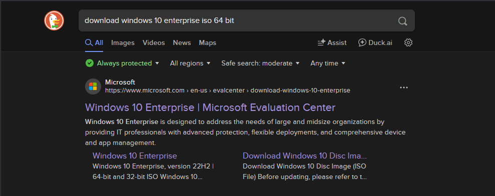
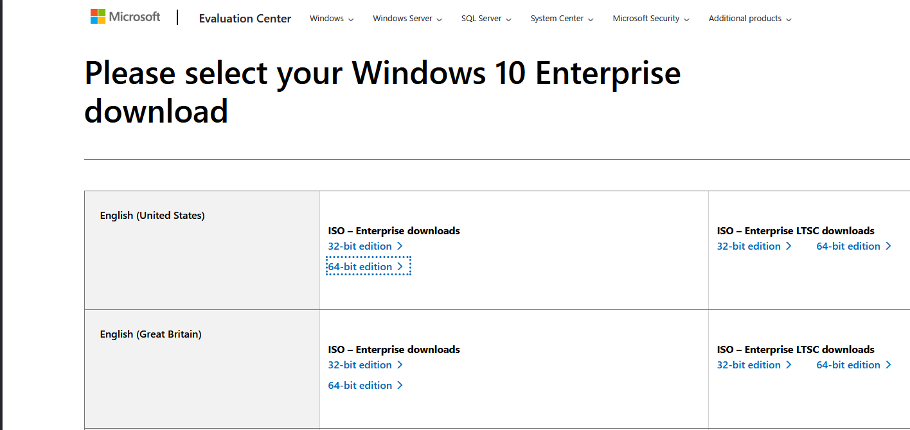
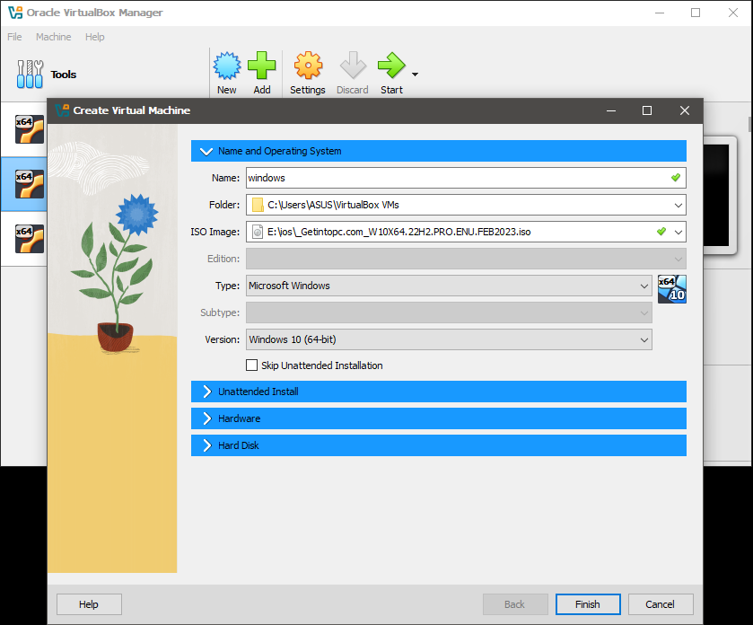
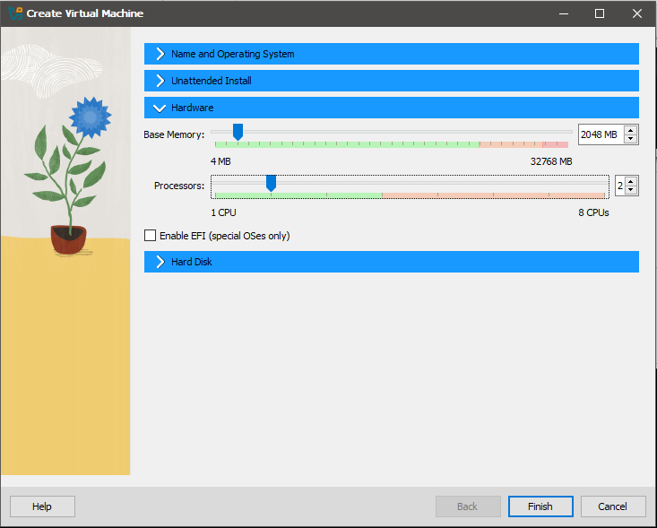
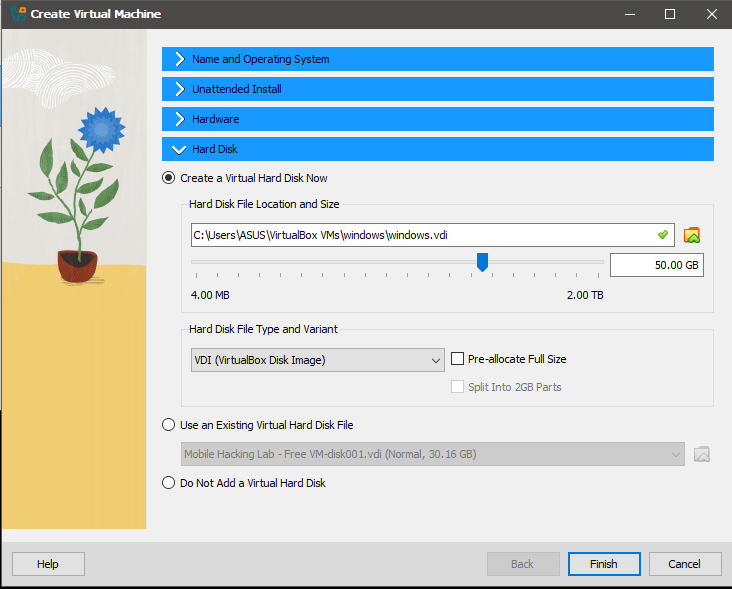
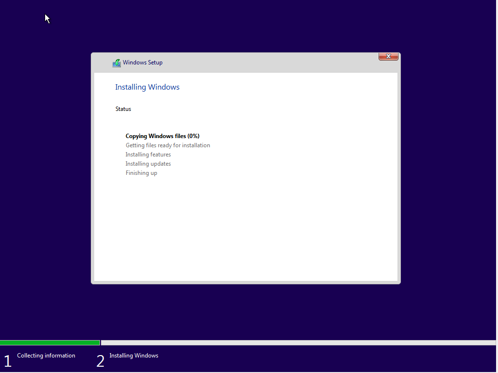

# 💻 VirtualBox မှာ Windows 10 Enterprise ကို Install လုပ်နည်း

ဒီလမ်းညွှန်ကတော့ VirtualBox ကို အသုံးပြု၍ Windows 10 Enterprise OS ကို Virtual Machine (VM) အဖြစ် တပ်ဆင်နည်းအဆင့်ဆင့်ဖြစ်ပါတယ်။  

## 🛠️ လိုအပ်သောအရာများ

1. [VirtualBox Download Link](https://www.virtualbox.org/wiki/Downloads)
2. Windows 10 Enterprise ISO file  
   👉 [Download from Microsoft Eval Center (90 days trial)](https://www.microsoft.com/en-us/evalcenter/evaluate-windows-10-enterprise)

---

## 🧱 အဆင့် ၁: VirtualBox ကို Install လုပ်ခြင်း
VirtualBox install လုပ်နည်းကို [ဒီမှာ](https://github.com/piinsec/how-to/blob/main/vbox-install/vbox-install.md) သွားကြည့်နိုင်ပါတယ်။

---

## 🧱 အဆင့် ၂: Windows 10 ISO ဖိုင် Download လုပ်ခြင်း

1. Google search မှာ "windows 10 enterprise" ဆိုပြီး ရိုက်ရှာလိုက်ပါ 
2. Windows 10 Enterprise Trial ISO ကို Microsoft Eval Center မှ [ဒီနေရာ](https://www.microsoft.com/en-us/evalcenter/evaluate-windows-10-enterprise) မှ download လုပ်နိုင်ပါတယ်။

3. 64 bit ကို ရွေးပြီး download လုပ်လိုက်ပါ။

---

## 🧱 အဆင့် ၃: Virtual Machine အသစ်တစ်ခုဖန်တီးခြင်း

1. VirtualBox ကိုဖွင့်ပါ။
2. `New` ကို နှိပ်ပါ။
3. VM Name ကို "Windows" လို့ထည့်ပါ။
4. Type ကို "Microsoft Windows", Version ကို "Windows 10 (64-bit)" ရွေးပါ။
5. ISO image ထည့်ပေးပါ။

   

---

## 🧱 အဆင့် ၄: Memory Size သတ်မှတ်ခြင်း

1. RAM အဖြစ် 4096 MB (4 GB) သို့မဟုတ် အနည်းဆုံး 2048 MB ထည့်ပါ။  
   (သင့် RAM ပမာဏပေါ်မူတည်ပြီး)

  

---

## 🧱 အဆင့် ၅: Virtual Hard Disk ဖန်တီးခြင်း
  
   

---

## 🧱 အဆင့် ၆: VM ကို Start လုပ်ပြီး Windows 10 Install လုပ်ခြင်း

1. Main menu မှာ Start ကိုနှိပ်ပြီး VM ကို boot လုပ်ပါ။
2. Windows Installer ပေါ်လာပါလိမ့်မယ်။
3. လိုအပ်သော setup steps (Language, Keyboard, etc.) ဖြည့်ပြီး `Install Now` ကို နှိပ်ပါ။

   

---

## 🧱 အဆင့် ၈: Installation Finish

1. Installation ပြီးသွားတာနဲ့ VM ပြန် restart လုပ်ပါလိမ့်မယ်။
2. Windows Desktop ပေါ်လာပြီး Windows 10 Enterprise ကိုအသုံးပြုနိုင်ပါပြီ။

---

## 📌 နောက်ထပ်အကြံပြုချက်များ

- Guest Additions ထည့်ပါ (Screen Resolution, Clipboard Sharing စတဲ့ Features အတွက်)

   📘 [How to Install VirtualBox Guest Additions](https://www.virtualbox.org/manual/ch04.html)

---

### 🎉 အစစအရာရာ အဆင်ပြေပါစေလို့ ဆုတောင်းပေးလိုက်ပါတယ်!

---
Installation video 🔗: [Watch here](https://youtube.com/piinsecurity)
